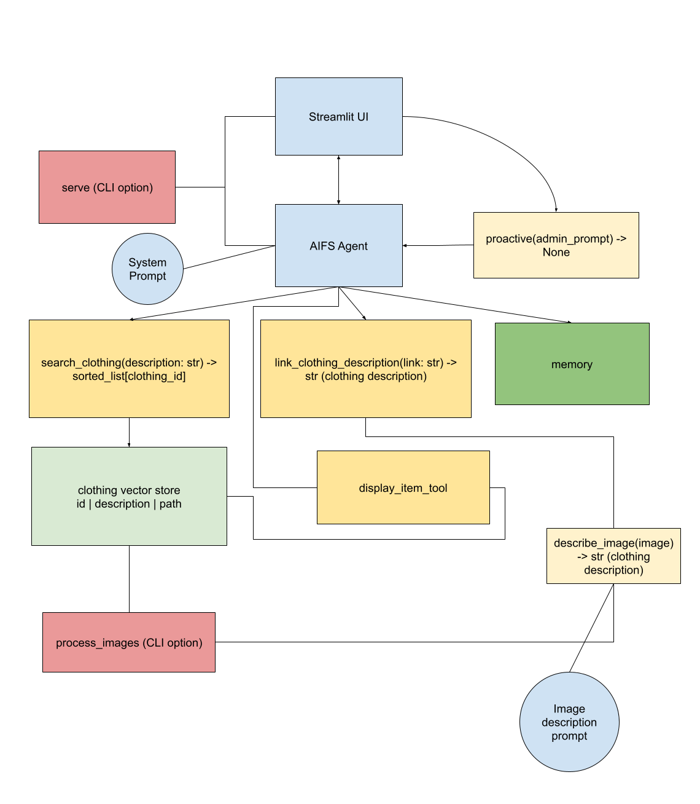

# AIFS – AI Fashion Stylist

AIFS is an intelligent conversational fashion assistant that helps users discover clothing items tailored to their preferences. It can interpret user intentions, including implicit needs, and responds to natural language queries, links to clothing items, or uploaded images by suggesting similar items. The system is built on LangGraph, LangChain, and Streamlit technologies.

## Setup Instructions

Install dependencies:

```
pip install -r requirements.txt
playwright install
```

Download the dataset and put it in AIFS/kaggle-dataset.
Create data/images and data/articles.csv (from AIFS/kaggle-dataset).

## Usage

Launch the fashion assistant interface:
```
python main.py serve
```

Process clothing images for search functionality:
```
python main.py process_images
```

Add random image samples from the dataset:
```
python main.py sample 50
```

## Tools

| Tool | Functionality |
|------|--------------|
| search_clothing_tool | Queries the database for clothing matching specific descriptions |
| display_item_tool | Renders clothing images with titles in the chat interface |
| link_clothing_description_tool | Extracts and describes clothing items from web links |
| describe_image | Analyzes uploaded images to identify and describe clothing items |
| proactive() | Initiates conversations with unsolicited but relevant suggestions |
| Memory | Maintains context and user preferences throughout conversations |

## Capabilities

- Event-based outfit recommendations (e.g., wedding attire)
- Can scrape web links for clothing descriptions
- Proactive suggestions based on seasons or trends
- Complementary item recommendations and proactive questions

## Technical Architecture

The system integrates LangGraph and LangChain for conversation management, specialized tools for search and display functionalities, OpenAI-powered Chroma for vector embedding storage, and a Streamlit interface for the interactive conversational experience with visual elements.


